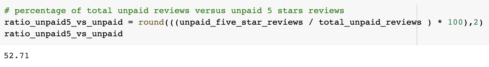

# Amazon_Vine_Analysis
Big Data

## **Project Overview**

Analyze Amazon reviews written by members of the paid Amazon Vine program. The Amazon Vine program is a service that allows manufacturers and publishers to receive reviews for their products. Companies like SellBy pay a small fee to Amazon and provide products to Amazon Vine members, who are then required to publish a review.

Out of a list of 50 different datasets, the Outdoor Reviews was the one chosen for this analysis, where the goal is to determine if having a paid Vine review makes a difference in the percentage of 5-star reviews.

## **Soulution Design**

### **Deliverable 1**

- Perform ETL on Amazon Product Reviews;
    - Pick a dataset from the Amazon Review datasets;
    - Create a new Google Colab Notebook;
    - Using PySpark:
        - Read in a CSV file;
        - Extract the dataset into a DataFrame;
        - Use its methods and functions to perform ETL;
        - Transform the DataFrame into four separate DataFrames that match the table schema in pgAdmin;
    - Create an AWS RDS database;
    - Upload the transformed data into the appropriate pgAdmin tables; 
    - Run queries using PostgreSQL in pgAdmin to confirm that the data has been uploaded.

### **Deliverable 2**
- Determine Bias of Vine Reviews;
    - Create a new Google Colab Notebook as a Jupyter Notebook file;
    - Read in a CSV file into a Jupyter Notebook through Googgle Colaboratory;
    - Use the same dataset used for deliverable 1.
    - Using PySpark:
        - Read in a CSV file into a Jupyter Notebook through Googgle Colaboratory;
        - Extract the dataset into a DataFrame;
        - Retrieve all the rows on the DataFrame where the total_votes count is equal to or greater than 20, which are the ones more likely to be helpful;
        - Create a new DataFrame out of the previous one to retrieve all the rows where the number of helpful_votes divided by total_votes is equal to or greater than 50%.
        - Create a new DataFrame out of the previous one that retrieves all the rows where a review was written as part of the Vine program (paid), vine == 'Y'.
        - Create a new DataFrame to retrieve all the rows where the review was not part of the Vine program (unpaid), vine == 'N'.
        - Determine the total number of reviews, the number of 5-star reviews, and the percentage of 5-star reviews for the two types of review (paid vs unpaid).
        - Export the ipynb file, and save it to the GitHub repository.

### **Deliverable 3**

- Write a Report on the Analysis (README.md)

## **Results**

### **1. Total Amount of Reviews**

- 37544

### **2. Total Amount of Paid Reviews**

- 103

### **3. Total Amount of Unpaid Reviews**

- 37441

### **4. Total Amount of 5-Star Paid Reviews**

- 55

### **5. Total Amount of 5-Star Unpaid Reviews**

- 19737

### **6. Percentage of 5-Star Paid Reviews**

- 0.28%

### **7. Percentage of 5-Star Unpaid Reviews**

- 99.72%

## **Summary**

### **DataFrame Displaying the Results**

- The following Dataframe displays:
    - Total Number of Reviews;
    - Total Number of 5-star reviews;
    - % of 5-star Unpaid Reviews (calculated by dividing the total number of unpaid 5-star reviews by the total number of 5-star reviews);
    - % of 5-star Paid Reviews (calculated by dividing the total number of paid 5-star reviews by the total number of 5-star reviews).

These results show that only 0.28% of the 5-star reviews came from paid ones, while 99.7% of them came from customers that do not participate on the Amazon Vine program, which says that the overall review score have little influence coming from paid 5-star reviews, but it does not tell if people that pay for the program give 5-star reviews or not.

### **Additional Analysis**

In order to further check for any bias towards 5-star paid reviews another calculation was performed, where it shows the ratio between the 5-star paid reviews and all the other paid reviews (1-star to 4-star).

The calculation resulted in 53.4% of the paid reviews are 5-star, while 46.6% of the paid reviews are among the 1-star to 4-star ones, meaning that there may be some bias on the reason why they are giving 5-star reviews since more than half of those are all 5-star.