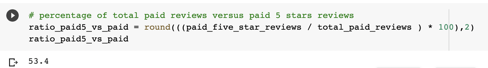
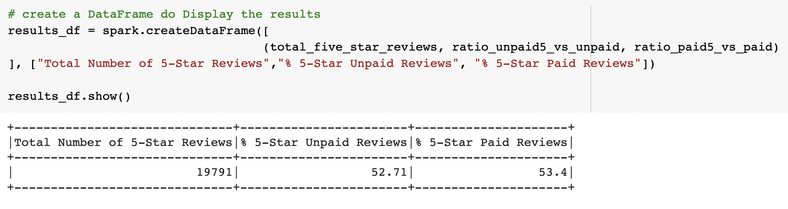

# Amazon_Vine_Analysis
Big Data

## Project Overview

## Results

### Total Reviews

How many Vine reviews and non-Vine reviews were there?

### Total Paid Reviews

### Total Unpaid Reviews

### Total 5 Stars Paid Reviews
How many Vine reviews were 5 stars? 

### Total 5 Stars Unpaid Reviews

How many non-Vine reviews were 5 stars?

### Percentage of 5 Stars Paid Reviews

What percentage of Vine reviews were 5 stars?

### Percentage of 5 Stars Unpaid Reviews

What percentage of non-Vine reviews were 5 stars?

### DataFrame Displaying the Results

## Summary

### Additional Analysis

INSTRUCTIONS
-------------------------------------------------------------------------------------

Overview of the analysis of the Vine program

------------------------------

Results: Using bulleted lists and images of DataFrames as support, address the following questions:

How many Vine reviews and non-Vine reviews were there?
How many Vine reviews were 5 stars? How many non-Vine reviews were 5 stars?
What percentage of Vine reviews were 5 stars? What percentage of non-Vine reviews were 5 stars?

------------------------------

Summary: In your summary, state if there is any positivity bias for reviews in the Vine program. Use the results of your analysis to support your statement. Then, provide one additional analysis that you could do with the dataset to support your statement.
